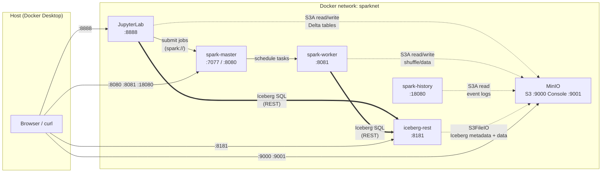
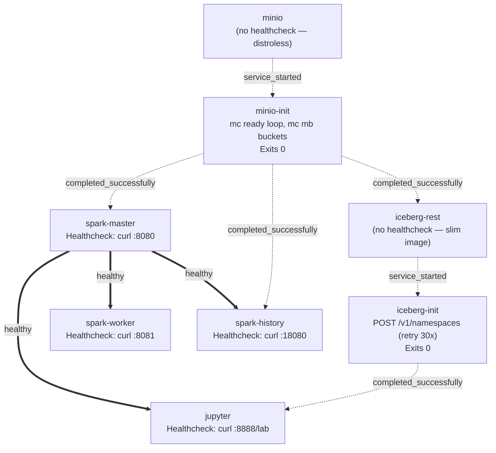
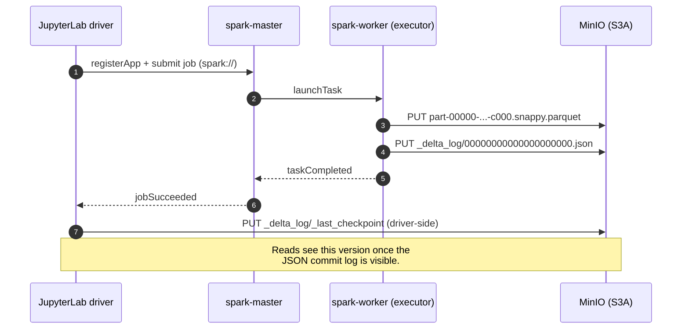
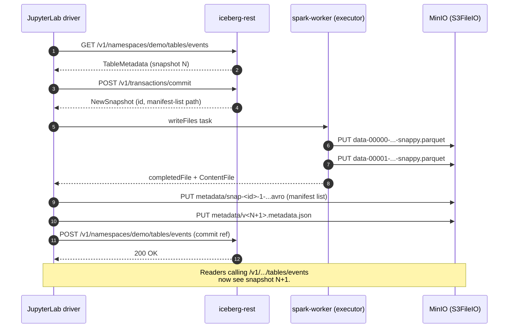
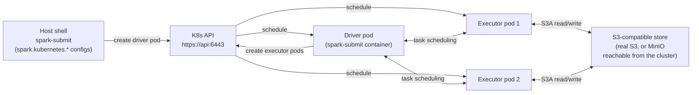

# Architecture

This stack runs a single Spark standalone cluster, a JupyterLab front-end, a MinIO S3-compatible object store, and an Iceberg REST catalog — all on one Docker bridge network (`sparknet`). Every Spark job (driver in JupyterLab, executors on the worker) reads and writes through MinIO via the S3A connector. Delta tables live as object trees under `s3a://spark-warehouse/delta/...`; Iceberg tables are catalogued via the REST service and physically stored at `s3a://spark-warehouse/iceberg/...`. Completed Spark applications upload their event logs to `s3a://spark-logs/events/`, where the History Server picks them up for post-mortem inspection.

The diagrams below show service topology, boot ordering, and the write paths for the two table formats. All diagrams are Mermaid; GitHub renders them inline.

## Service topology



## Boot order

`docker compose up` follows the dependency chain below. Solid arrows are
`condition: service_healthy`; dotted arrows are `service_completed_successfully`
(one-shot init containers) or `service_started`.



The init containers replace traditional healthchecks for MinIO and Iceberg REST, whose container images lack `curl`/`wget`. `minio-init` polls `mc ready local` until S3 is truly serving; `iceberg-init` retries the namespace POST against the live REST endpoint. Either failing aborts dependent services.

## Delta Lake write path

A `df.write.format("delta").save("s3a://...")` call from JupyterLab:



For UPDATE/DELETE, the driver-side Delta extension reads the current snapshot, computes file rewrites, and the workers emit new parquet files + a new `*.json` log entry. Time travel (`versionAsOf=N`) just resolves the snapshot at log entry `N` and ignores later files.

## Iceberg write path

Iceberg uses the REST catalog for table metadata and `S3FileIO` directly for data. Note the data path bypasses the S3A connector — `S3FileIO` talks to MinIO via the AWS SDK v2 (this is why the executor needs `spark.sql.catalog.iceberg.s3.region` even for local MinIO).



Snapshot history is queryable as a metadata table: `SELECT * FROM iceberg.demo.events.snapshots` returns one row per commit, including the operation type (`append`, `overwrite`, etc.) and the manifest list location.

## MinIO bucket layout

After `minio-init` runs:

```
spark-warehouse/                Delta and Iceberg tables share this bucket
├── delta/
│   └── people/                 Demo notebook 01
│       ├── _delta_log/
│       │   ├── 00000000000000000000.json
│       │   ├── 00000000000000000001.json
│       │   └── ...
│       └── part-00000-...c000.snappy.parquet
└── iceberg/
    └── demo/
        └── events/             Demo notebook 02
            ├── data/
            │   └── ts_day=2026-06-01/
            │       └── 00000-0-....parquet
            └── metadata/
                ├── v1.metadata.json
                ├── snap-...avro
                └── ...

spark-logs/                     History Server source
└── events/
    └── app-20260603174619-0005.inprogress  (live app)
    └── app-20260603174619-0005             (completed; History Server ingests)

raw-data/                       Empty by default; intended for ingestion tests
```

## Network + identity model

- **Single Docker bridge network** (`sparknet`). DNS-by-service-name is what makes `spark://spark-master:7077`, `http://minio:9000`, and `http://iceberg-rest:8181` resolve. None of these hostnames are reachable from the host — use `localhost:<published port>` from the host instead.
- **No service-to-service auth.** Every container trusts every other container on the same bridge. Acceptable for a single-user laptop demo; not for shared environments.
- **S3 credentials** are static (`MINIO_ACCESS_KEY` / `MINIO_SECRET_KEY` from `.env`). They're injected into Spark via `envsubst` over `spark-defaults.conf` at container start and exported as `AWS_ACCESS_KEY_ID` / `AWS_SECRET_ACCESS_KEY` to Iceberg REST.
- **JupyterLab is token-less** by default (`JUPYTER_TOKEN=` in `.env.example`). Set a value if you want token auth.

## Remote Kubernetes mode

`scripts/k8s-spark-submit.sh` runs **on the host**, not in any container. It submits via `spark-submit --master k8s://https://<api>` so the driver and executors run as pods in your real cluster. The S3 path you supply (`S3_ENDPOINT`) must be reachable from inside that cluster — usually a real AWS S3 endpoint, not `http://minio:9000`.



The serviceaccount (`K8S_SA`, default `spark`) on the driver pod needs RBAC to create executor pods, configmaps, and services. The README quick-starts that with `clusterrolebinding ... --clusterrole=edit`; tighten that for shared clusters.
